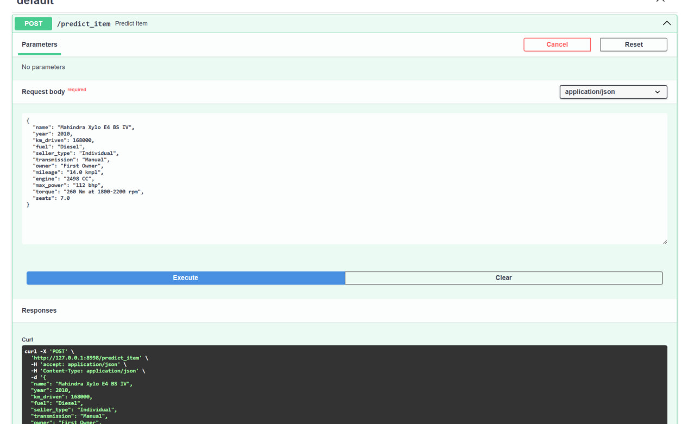
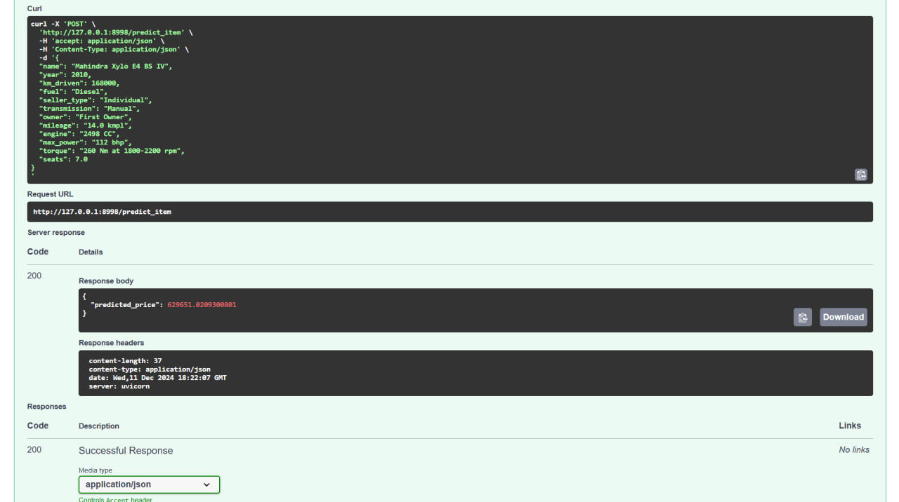
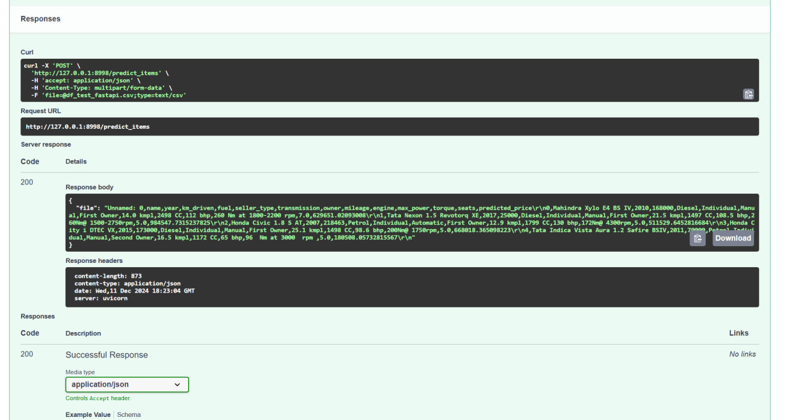

# Итоговый отчет о проделанной работе

## Задания в блокноте
- Были выполнены все задания в блокноте. Отчет по конкретным заданиям находится в блокноте в соответствующих секциях
- Были выполнены различные стадии предобработки данных (анализ фичей, обработка данных, скейлинг, добавление категориальных фичей и дополнительный feature engineering)
- Были построены различные модели и подсчитаны метрики для их сравнения

## Результаты для моделей

### 1. Классическая линейная регрессия с дефолтными параметрами только на числовых фичах
**Тестовые данные:**
- R^2 = 0.6016
- MSE = 229030855463.67
- MAE = 219867.37

### 2. Классическая линейная регрессия только на числовых фичах с использованием StandardScaler
**Тестовые данные:**
- R^2 = 0.6016
- MSE = 229030855463.65
- MAE = 219867.37

### 3. Lasso модель только на числовых фичах с использованием StandardScaler 
**Тестовые данные:**
- R^2 = 0.6016
- MSE = 229031568984.16
- MAE = 219867.04

### 4. Lasso модель только на числовых фичах с использованием StandardScaler и GridSearch
**Тестовые данные:**
- Лучший коэффициент регуляризации alpha: 1000
- R^2 = 0.6003
- MSE = 229769350842.52
- MAE = 219552.95

### 5. ElasticNet модель только на числовых фичах с StandardScaler и GridSearch
**Тестовые данные:*
- Лучший параметр alpha: 0.05
- Лучший параметр l1_ratio: 0.7
- R^2 = 0.5986
- MSE = 230723251506.82
- MAE = 218927.57

### 6. Модель только на числовых фичах с L0-регуляризацией (AIC и BIC)
**Лучшие результаты (тестовые данные):**
- Лучший AIC: 87217.96, MSE = 219240.3355, R^2 = 0.5957, с фичами ('year', 'km_driven', 'mileage', 'engine', 'max_power', 'torque')
- Лучший BIC: 87264.67, MSE = 219240.3355, R^2 = 0.5957, с фичами ('year', 'km_driven', 'mileage', 'engine', 'max_power', 'torque')

### 7. Ridge модель с категориальными фичами с использованием StandardScaler и GridSearch
**Тестовые данные:**
- Лучший параметр alpha: 0.0001
- MSE = 209527722680.7243
- R^2 = 0.6355
- MAE = 213646.9701

### 8. Ridge модель с категориальными фичами с использованием StandardScaler и GridSearch после Feature Engineering
**Тестовые данные:**
- Лучший параметр alpha: 0.0001
- MSE = 174007095998.6524
- R^2 = 0.6973
- MAE = 200399.4328
---

## Наилучшая модель
Наилучшей моделью оказалась **Ridge модель с категориальными фичами с использованием StandardScaler и GridSearch после Feature Engineering**.

**Результаты:**
- MSE = 174007095998.6524
- R^2 = 0.6973
- MAE = 200399.4328

Эта модель показала наивысшее значение R^2 и наименьшее значение MSE / MAE на тестовых данных.

## Что дало наибольший буст в качестве
- Наибольший буст дало применение добавление категориальных фичей с использованием StandardScaler и GridSearch, а также Feature Engineering

## Что сделать не вышло и почему
- В целом не получилось достичь значительного прироста в качестве. Эксперементы не дали значительного роста метрик. Стоит попробовать более детальный подход к Feature

## FastAPI сервис
- Был создан FastAPI сервис, который корректно проводить предобработку данных и выдает результаты для одиночных запросов и множественных. df_test_fastapi - файл, который отправляется как входные данные (множественные запросы)

## Выводы
- В ходе работы были разработаны модели прогнозирования стоимости автомобилей с использованием регрессии Ridge, Lasso и тд, включающая комплексную предобработку данных и создание кастомных бизнес-метрик. Также был реализован FastAPI сервис, позволяющий получать предсказания как для отдельных автомобилей, так и для наборов данных в формате CSV.

## Фото

